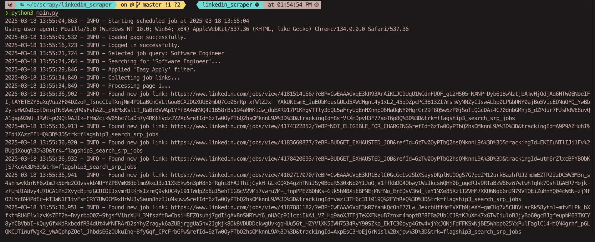
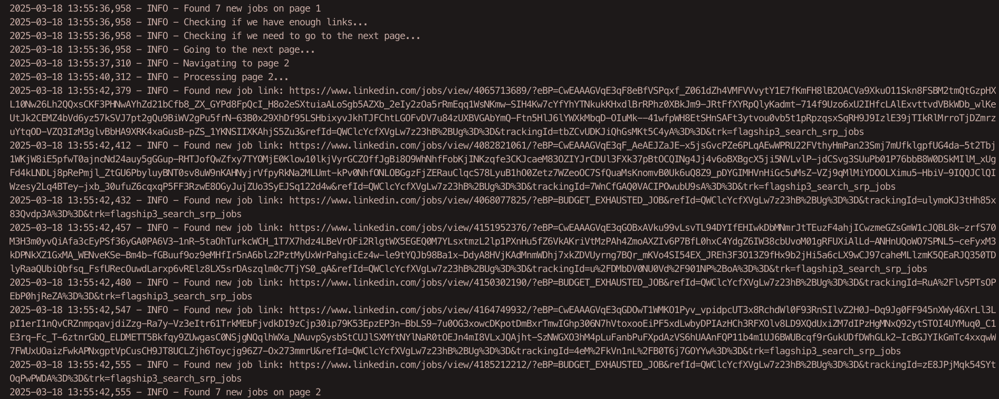

# LinkedIn Job Scraper

The **LinkedIn Job Scraper** is a Python-based web scraping tool designed to automate the process of searching for job postings on LinkedIn using **Selenium**. This tool allows users to extract job details such as title, description, salary, location, and company information. The scraped data can be saved to a JSON file or stored in a Supabase database for further analysis.

## Features

- **Automated Job Search**: Automatically searches for jobs based on predefined queries.
- **Data Extraction**: Extracts job details including title, description, salary, location, and company information.
- **Easy Apply Filter**: Applies the "Easy Apply" filter to streamline the application process.
- **Data Storage**: Saves scraped job data to a JSON file and a Supabase database.
- **Configurable**: Easily configurable job queries and settings.
- **Logging**: Comprehensive logging for monitoring the scraping process.
- **Scheduling**: Schedules the scraper to run at regular intervals.
- **Error Handling**: Handles common errors and exceptions gracefully.

## Installation

To set up the LinkedIn Job Scraper, follow these steps:

1. **Clone the repository**:
   ```bash
   git clone https://github.com/Raksha-Karn/InScraper.git
   ```

2. **Create a virtual environment** (optional but recommended):
   ```bash
   python -m venv venv
   source venv/bin/activate  # On Windows use `venv\Scripts\activate`
   ```

3. **Install the required packages**:
   ```bash
   pip install -r requirements.txt
   ```

4. **Set up environment variables**:
   Create a `.env` file in the root directory and add your LinkedIn credentials:
   ```
   EMAIL=your_email@example.com
   PASSWORD=your_password
   ```

5. **Download the ChromeDriver**:
   Ensure you have the ChromeDriver installed and the path is correctly set in `config.py`.

## Usage

To run the LinkedIn Job Scraper, execute the following command:

The scraper will start running and will log its progress. It is scheduled to run every 30 minutes by default.

```bash
python main.py
```

# Screenshots



